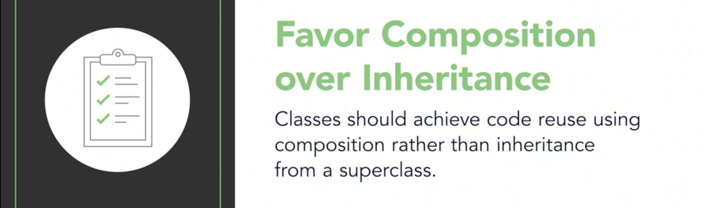

== Design Principles
Design Principles are general guidelines on how to develop quality software and avoid bad object-oriented design.
These are not rules or laws.
These are common-sense rules that have been observed to result in good object-oriented designs.
Help us to avoid bad OO design.

.Symptoms of bad OO Design
. Rigid - hard to change
. Fragile - when making changes, you end up with unexpected bugs
. Immobile - hard to reuse

=== Encapsulate what Varies

.Encapsulate what varies
image::images/encapsulte_what_varies.png[]

----
Design Principle - Encapsulate what Varies.

If some aspect of your code is changing, that's a strong indication that you need to pull out those parts that are changing and to
separate them from the rest of your code.

By separating out the parts of your code that change, you can extend or alter them without affecting the rest of your code.

This principle is fundamental to almost every design pattern.
----

=== Favor Composition over Inheritance
.Favor Composition over Inheritance

----
Design Principle - Favor Composition over Inheritance
Instead of inheriting behavior, composition delegates the behavior to the composed object.
Leads to a more *flexible and extensible design*.
Allows for changing the behavior dynamically during runtime, no code duplication and avoid class explosion (so many classes).
"Has-A is better than IS-a."
----

=== Loose Coupling
.Loose Coupling
image::images/loose_coupling.png[]
----
Design Principle - Loose Coupling
Components should be independent, relying on knowledge of other components as little as possible.
Loosly coupled objects are objects that interact but donot know much about each other.
Loosly coupling reduces the dependency between components.
Helps us to minimize complexity of a scenario.
Helps us to build object-oriented systems that can *handle change well*.
The observer pattern exemplifies the design principle of loose coupling.
Opposite - Tight Coupling
----

=== Program to an interface, not an implementation
.Program to an interface, not an implementation
image::images/program_to_interfaces.png[]
----
Design Principle - Program to an interface, not an implementation
Clients remain unaware of the specific types of objects they use, as long as the objects adhere to the interface that clients expect.
e.g.
    [source] Duck duck = new MallardDuck();
Allow our designs to be more flexible, extensibility and maintainable.
Program to an interface really means *program to a super type* (e.g. Interface, Abstract class, ...).
Allows you to better exploit Polymorphism.
Frees classes from knowledge of concrete types.
----

=== Single Responsibility Principle
.Single Responsibility Principle

----
Design Principle - Single Responsibility Principle (SRP)
Definition:: A class should have only one reason to change.
Example:: Think of a restaurant. Every person has a specific role. The waiter is responsible for taking orders only. They don't cook for you.
Imagine a restaurant where the waiter takes your order, cooks for you, goes shopping and does the taxes. This is unmanageable.

This principle is all about limiting the impact of change.

Adhering to this principle minimizes the chances that a class is going to need to change in the future.

One thing to remember about giving responsibilities to a class, is that for every additional responsibility, a class has another reason it might have to change in the future. So by giving a class multiple responsibilities we give the class more than one reason it might have to change.

Ask the questions
- `do these methods make sense together?`
- `Is the interface cohesive?` See: Interface Segregation Principle.

*NOTE*
Apply SRP when the need is real, or you're just creating complexity.
----

=== Open-Closed Principle
----
Design Principle - Open-Closed Principle
Definition:: Classes should be open for extension but closed for modification.
Ensures flexibility, maintainability and robustness because we can add new behavior without the risk of introducing bug in the existing code.

Whenever you want to add a functionality, you should create new classes and test those. Instead of changing existing code.

Allows adding new behaviour without risking changes to proven code.
Many techniques to do this such as 'Favor Composition over Inheritance', including the use of design patterns.
E.g. Adding new fly behavior to Ducks by implementing the FlyBehavior interface.
----

=== Liskov Substitution Principle
----
Design Principle - Liskov Substitution Principle
Definition:: You should always be able to *substitute* subtypes for their base class.
If they aren't we can end up with *code reliability issues*.

When creating class hierarchies (using Inheritance), we should be careful as we might end up with a hierarchy that doesn't adhere well to open-closed
principle. So, don't assume that the `Is-a` relationship will always result in a hierarchies that adhere to Liskov substitution principle.

The only way to really ensure that we don't violate the Liskov substitution principle is to employ a technique like say *designed by contract*.
----
.Liskov Substitution Principle Violation Example

=== Interface Segregation Principle
----
Design Principle - Interface Segregation Principle
Definition:: Classes should *not* be forced to depend on methods that they don't use.
This principle is all about the disadvantages of what we might call a _polluted interface_.

Cohesion:: How strong are the relationships between an interface's methods and data?
Highly cohesive if the methods are related and Low cohesion if methods serve different purposes.

* Polluted interfaces also lead to situations where various implementations don't behave the same way.
* Keep an eye on cohesion in your interfaces.
* Keeping interfaces highly cohesive leads to more maintainable and flexible systems.
----
.Interface Segregation Principle Example

=== Dependency Inversion Principle
----
Design Principle - Dependency Inversion Principle
Definition:: High level modules should *not* depend on low-level modules.
Both high level and low level modules should *depend on Abstraction*.
Abstraction should not depend on details; rather detail should depend on abstraction.

Helps design software that is reusable and resilient to change.
----
.Dependency Inversion Principle Model

.Dependency Inversion Principle Example

== References
https://dzone.com/articles/the-5-solid-principles-explained