= Design Patterns
Biniam Asnake
1.0.0
:icons: font

== Object Oriented Programming Concepts
Interface:: a contract that specifies the functionalities/capabilities a class should provide
Encapsulation:: hiding the implementation detail
Abstraction:: reduce complexity by hiding unnecessary details (e.g. expose only one method and making others private). Promotes less coupling.
Inheritance:: a mechanism for reusing code by creating 'is-a' relationship between parent/super and child/sub classes. Promotes DRY
Polymorphism:: Poly means 'many', morph means 'form'. Hence, it is the ability of an object to take many forms

----
UML: Unified Modelling Language - official language to model our system to represent classes and their relationships.
----

.Types of Relationships
- Inheritance relationship (line with an unfilled rectangle)
[source] public class Rectangle extends Shape {}
- Composition relationship (arrow with a filled diamond)

[source]
----
public class Shape {
    //  Shape class is composed of a Size class
    private Size size;
}
----
- Aggregation relationship (arrow with an empty diamond)
- Dependency relationship (dashed arrow)
[source]
----
public class Shape {
    // Shape class depends on the Document class
    public void render(Document doc) {}
}
----

[NOTE]
====
.Aggergation vs Composition
- Aggregation implies a relationship where the child can exist independently of the parent. Example: Class (parent) and Student (child). Delete the Parent
Class and the Students still exist.
- Composition implies a relationship where the child cannot exist independent of the parent. Example: House (parent) and Room (child). Rooms don't exist
separate to a House.
Source: https://www.visual-paradigm.com/guide/uml-unified-modeling-language/uml-aggregation-vs-composition/
====

== Design Patterns
Design patterns are general solutions to common OO problems.
They are time-tested, reusable OO designs that solve many common design problems.
It is an approach to thinking about software design that incorporate the experience of developers who have had similar problems.

Goal:: To create object-oriented software that is more flexible, maintainable, extensible and reliable.

.Benefits
. Not reinventing the wheel
. Building resilient code that can withstand change
. Prepare for future additions and change
. Serves as shared vocabularies
.. Patterns allow you to say more with less
.. Talking at the pattern level allows you to stay 'in the design' longer
.. Shared vocabularies can turbo-charge your development team - go faster and less misunderstanding
.. Shared vocabularies encourage more junior developers to get up to speed.

=== Design Principles vs Design Patterns
Design Principles:: general guidelines on how to develop quality software and avoid bad object-oriented design.
A bad design is one that is too rigid and inflexible, or is hard to reuse.
E.g. 'Encapsulate what varies'
Design Patterns:: specific design solutions often named at solving common OO problems.
E.g. The Strategy pattern, the Iterator pattern, the Factory pattern

*Principles* are aimed at the *low level* of _how we put objects together_, while *patterns* are aimed at *larger problems*.
Many design patterns are inspired by design principles.

=== Design pattern categories
In the Gang of Four catalog, patterns are categorized primarily by their purpose.
Creational patterns:: relate to creating or instantiating objects. It provides a way to decouple the client, that is the part of the system instantiating
and using the objects, from the objects it needs to instantiate.
Behavioral patterns:: relate to how classes and objects interact.
Structural patterns:: relate to how classes and objects are composed into larger structures.

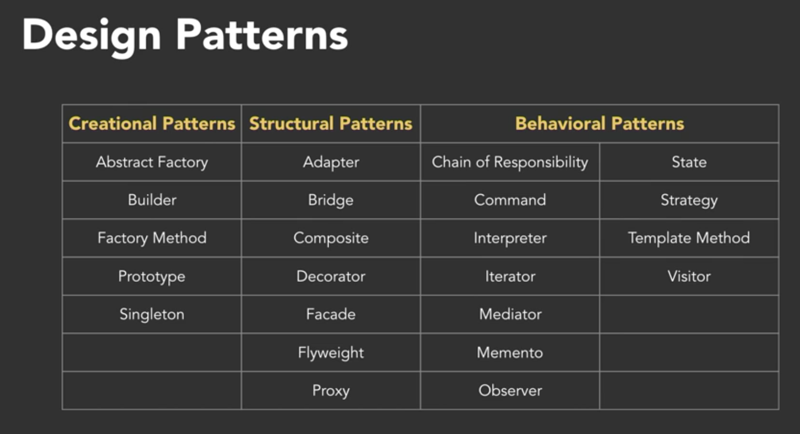

== Creational Patterns
The goal of all Creational Patterns is to give us more flexibility in *how* we create objects, *what kinds of* objects get created, and *who's responsible* for creating them.

Most of the patterns allow us to _abstract away the concrete types_ a client uses so that the client depends only on the abstraction, that is the interface,
rather than the concrete types themselves. This makes adding new types and behaviors a lot easier and error-prone.

=== Problems with inheritance
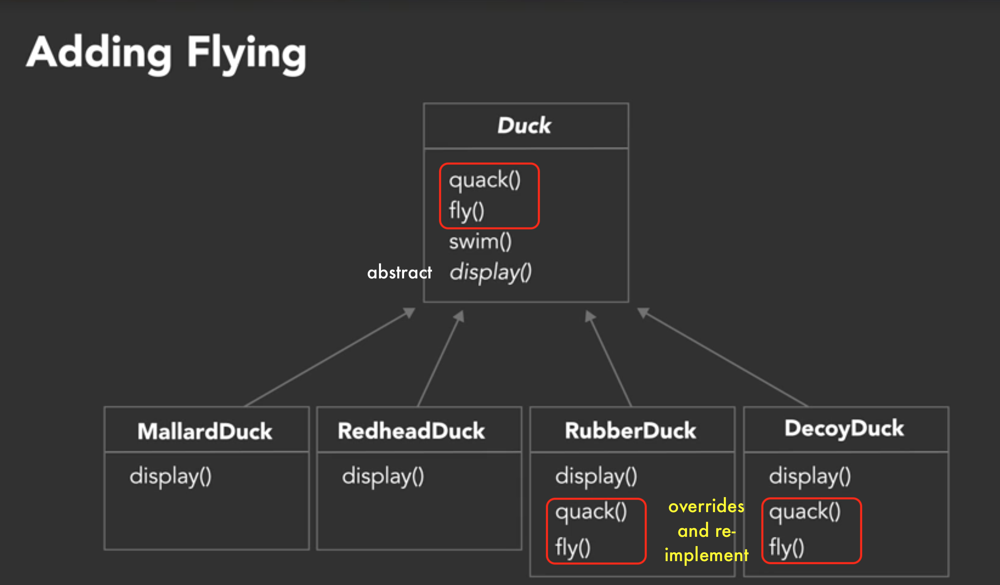

. Because we are overriding a lot of methods, we are not getting the benefits of inheritance like code reuse
. We have code duplicated across classes like no flying and quacking overriding
. It is hard to get the whole knowledge about ducks by looking at the super class
. Changes can lead to unintended side effects
. All behaviour is assigned at compile time. Hence, runtime behaviour change is difficult
. Inheritance is powerful but it can lead to inflexible and fragile designs.

=== Interfaces for the rescue?
. An interface defines the methods an object must have inorder to be considered a particular type
. Interfaces allow different classes to share similarities. Not all classes need to have the same behavior, though.

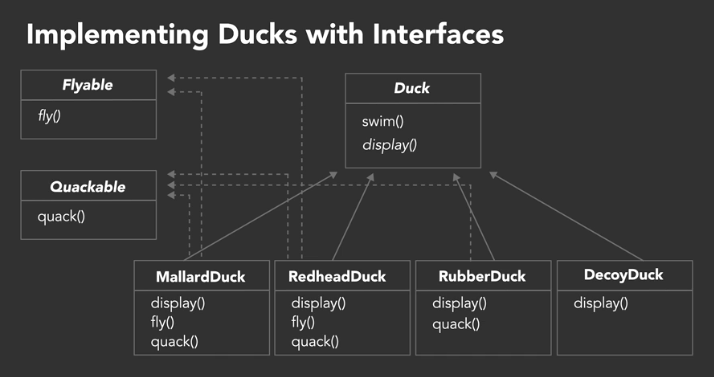

.Problems
. It destroys code reuse - every duck will implement its own fly() and quack() method
. Hence, maintenance becomes a nightmare
. It doesn't allow for runtime changes in behaviour

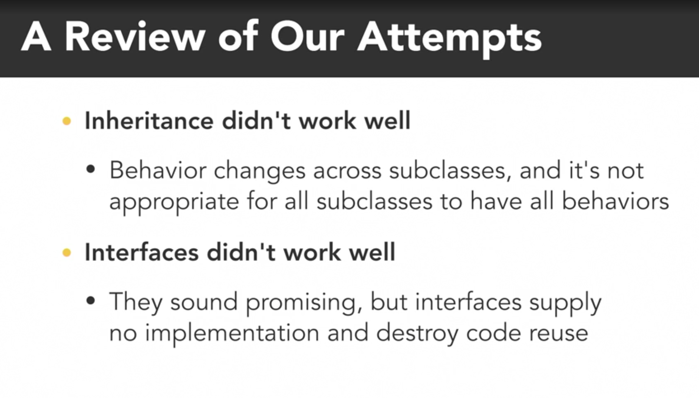

----
Design Principle - Encapsulate what Varies.

If some aspect of your code is changing, that's a strong indication that you need to pull out those parts that are changing and to
separate them from the rest of your code.

By separating out the parts of your code that change, you can extend or alter them without affecting the rest of your code.

This principle is fundamental to almost every design pattern.
----

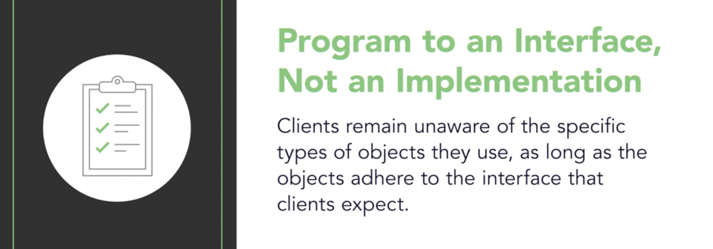

----
Design Principle - Program to an interface, not an implementation
Clients remain unaware of the specific types of objects they use, as long as the objects adhere to the interface that clients expect.
e.g.
    [source] Duck duck = new MallardDuck();
----

=== Strategy Pattern
Type:: Behavioural
Definition:: The Strategy Pattern defines a family of algorithms, encapsulates each one, and makes them interchangeable. This lets the algorithm vary
independently from clients that use it.

.Strategy pattern class diagram
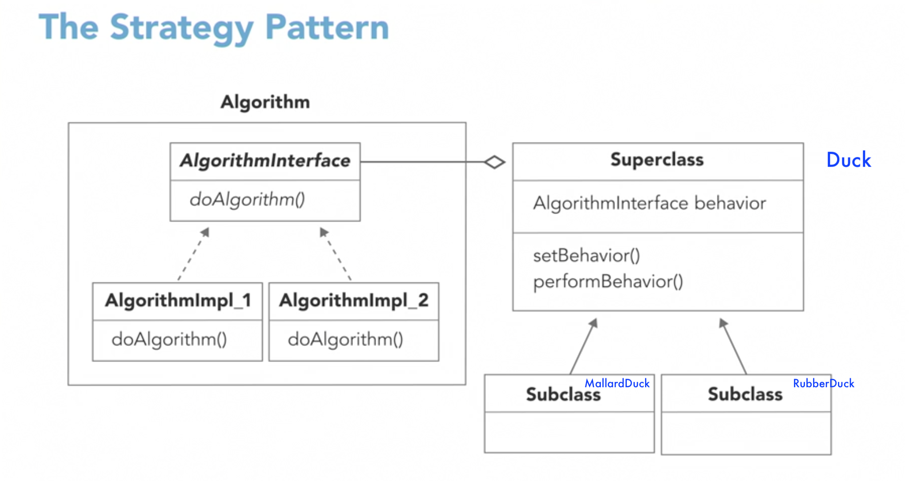
.Pattern Example - Ducks
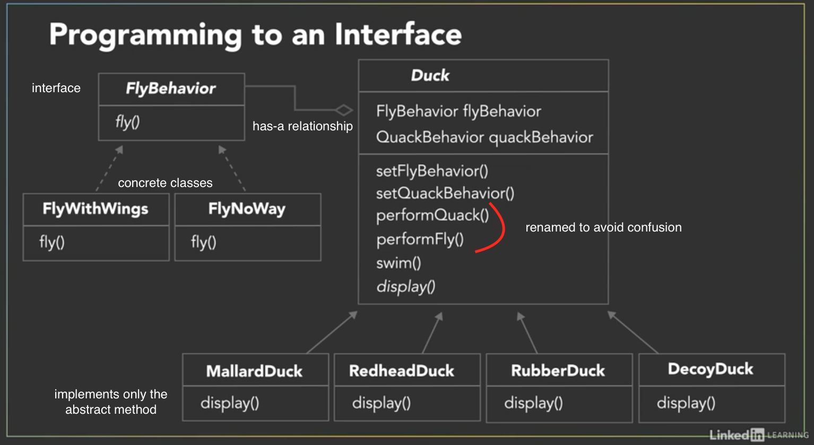
.Pattern Example - Phone Camera App
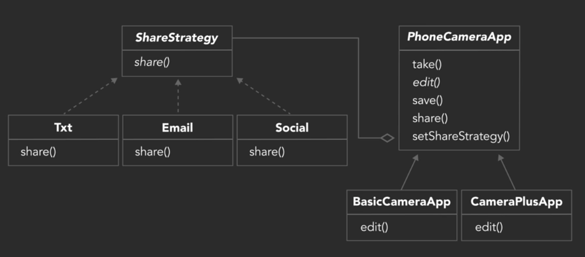

.favor_composition_over_inheritance
image::images/favor_composition_over_inheritance.png[]

----
Design Principle - Favor Composition over Inheritance
Instead of inheriting behavior, composition delegates the behavior to the composed object.
Leads to a more flexible and extensible design.
Allows for changing the behavior during runtime.
----

=== Adapter Pattern
Type:: Structural
Definition:: The Adapter Pattern converts the interface of a class into another interface clients expect. It allows classes to work together that couldn't
otherwise because of incompatible interfaces.

.Definition
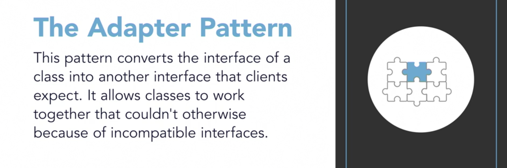
.Class Diagram
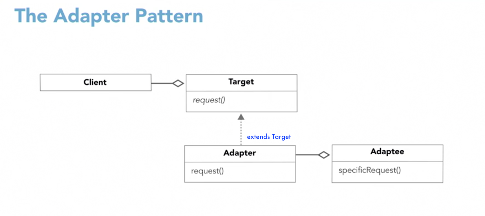
.Example
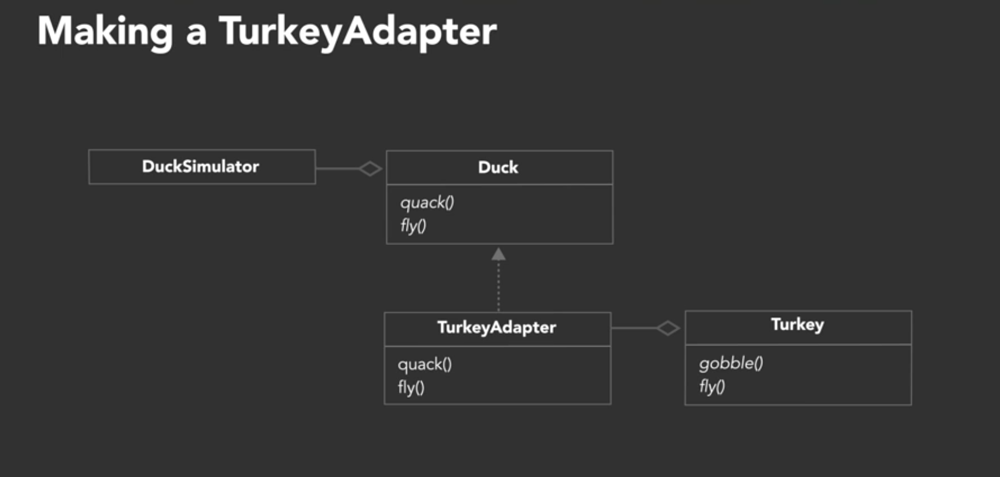

.Adapters use Composition
. The client is composed with the adapter class, and the Adapter is composed with the adaptee.
. The adapter sits between the client and the adaptee.
. The adapter delegates calls to the adaptee, and returns any needed value.
. The advantage of the Adapter Pattern is you can add an adapter easily without having to modify the adaptee at all, and only modify the client to add the
adapter.
. Useful when working with Vendor classes which we can't modify.

----
Design Principle - Loose Coupling
The observer pattern exemplifies the design principle of loose coupling.
Loosly coupled objects are objects that interact but donot know much about each other.
Helps us to minimize complexity of a scenario.
----
image::images/loose_coupling.png[]

. The Subject/Publisher owns the copy of the data which makes the design cleaner than many objects owning the data.
. The Dependents/Subscribers/Observers gets notified when the data changes in the Subject/Publisher.

=== Observer pattern
Type:: Behavioral
Definition:: This pattern defines a one-to-many dependency between objects so that when one object changes state, all of its dependents are notified and
updated automatically.

.Class Diagram
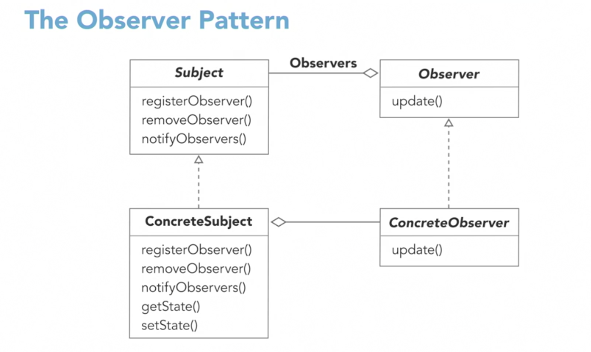
.Publisher and Subscribers
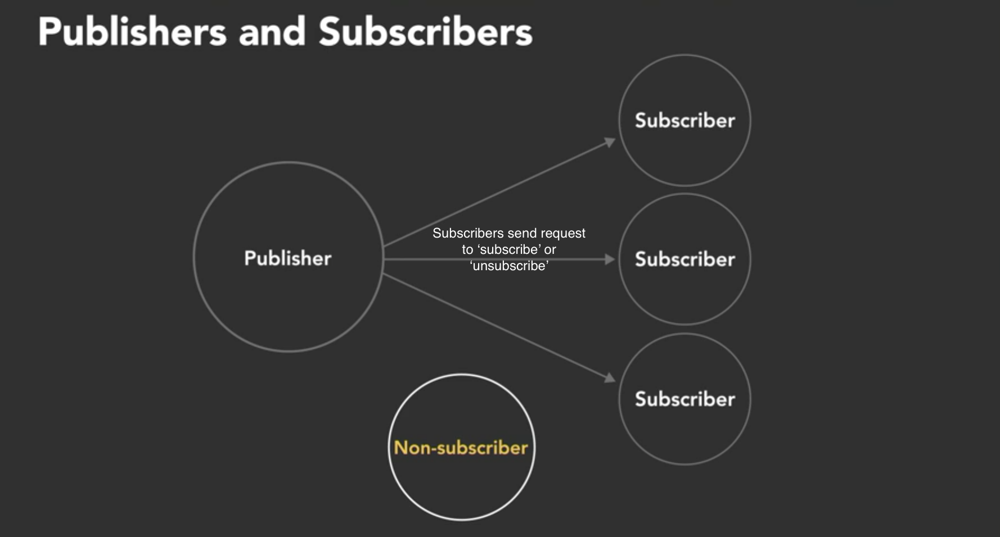

----
Design Principle - The Open-Closed Principle
Classes should be open for extension but closed for modification.
Ensures flexibility, maintainability and robustness because we can add new behavior without the risk of introducing bug in the existing code.

Whenever you want to add a functionality, you should create new classes and test those. Instead of changing existing code.
----

=== Decorator Pattern
Type:: Structural
Definition:: This pattern attaches additional responsibilities to an object dynamically. Decorators provide a flexible alternative to subclassing for
extending functionality.

.Class Diagram
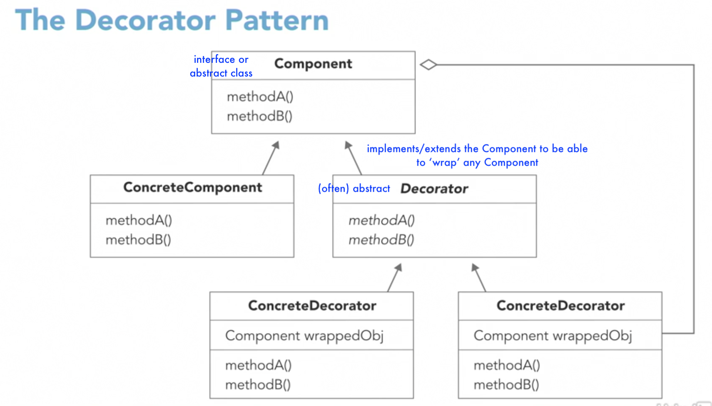
.Example
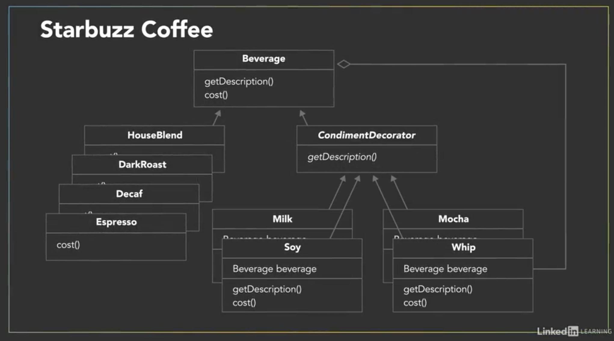
.How it works
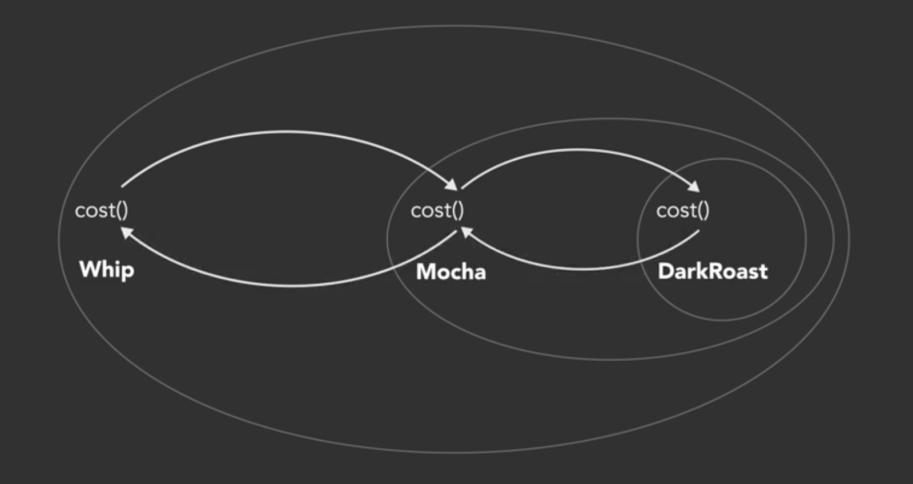

Decorator pattern uses Composition in a different way than Strategy pattern.

.Inheritance Advantages
. Powerful, but it can lead to inflexible designs
. All classes inherit the same behavior

.Composition Advantages
. We can still 'inherit' behavior by composing objects
. We can make dynamic runtime decisions
. We can add new behavior without altering existing code
. We can include behaviors not considered by the creator
. The end result often proves fewer bugs and side effects, and flexible designs.

By using composition, we get *flexibility* in how we add _capabilities_ (e.g. condiments) to our _components_ (e.g. beverages).
By using inheritance (a common beverage super type), we get the type structure we need to treat sub classes as the super class (treat coffees and decorated
coffees both as beverages. So, we can decorate beverages multiple times and call get description and cost on basic coffees or decorated coffees.

=== Iterator Pattern
Type:: Behavioural
Definition:: This pattern provides a way to access the elements of an aggregate object sequentially without exposing its underlying representation.

.Class Diagram
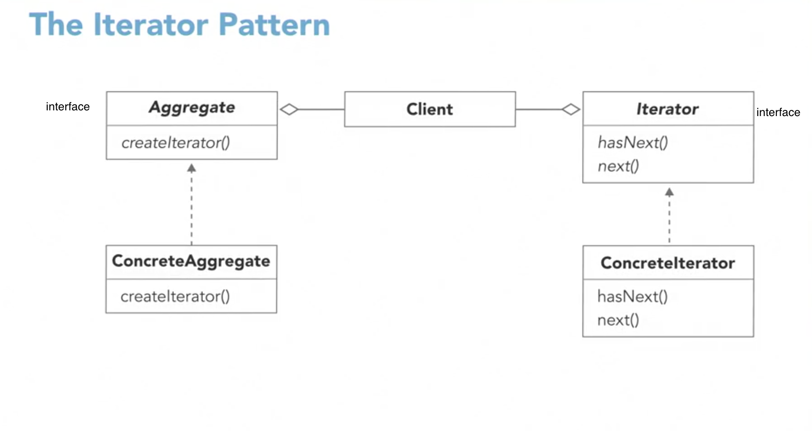
.Example
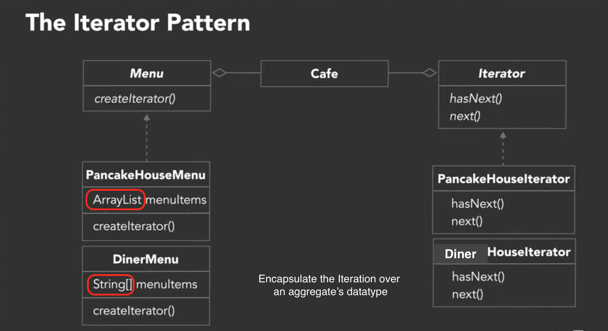

Aggregate objects collect Objects. E.g. Arrays, Java Collection classes like ArrayList, List, Set, Map, Dictionary

.To iterate over an aggregate object using the Iterator pattern
. Ask the object for its iterator
. Use the iterator to iterate through the items in the aggregate.
. Iteration code now works with any kind of aggregate object.

.Using built-in iterators
- Java offers a built-in iterator interface, Java.util.iterator.
- The java.util.iterator interface acts both as an interface that your own iterator classes can implement as well as the type of the Java collection classes built-in iterators.
- Classes like ArrayList, Vector and LinkedList all have an iterator method that returns a ready built iterator with a type java.util.iterator.
- Java arrays *don't* have built-in iterators.

.Built-in iterators in languages and used in statements while hiding the Iterator pattern and make it easy
- Java's *enhanced for* statement - used for Collections and arrays
[source, java]
----
    for (Animal a: animals) {
        a.makeSound()
    }
----

- Python's *for/in* statement - used for string, list and tuple
[source]
----
    for i in range(1,10):
        print(i)
----

- JavaScript's *for/of* statement - used in string, array, map, set
[source]
----
    for (let value of aggregate) {
        console.log(value)
    }
----

----
Design Principle - Single Responsibility Principle (SRP)
Definition:: A class should have only one reason to change.
Example:: Think of a restaurant. Every person has a specific role. The waiter is responsible for taking orders only. They don't cook for you.
Imagine a restaurant where the waiter takes your order, cooks for you, goes shopping and does the taxes. This is unmanageable.

Adhering to this principle minimizes the chances that a class is going to need to change in the future.

One thing to remember about giving responsibilities to a class, is that for every additional responsibility, a class has another reason it might have to change in the future. So by giving a class multiple responsibilities we give the class more than one reason it might have to change.
----

=== Factory Method Pattern
Type:: Creational
Definition:: The Factory Method pattern defines an interface for creating an object, but lets subsclasses decide which class to instantiate. Factory Method
lets a class *defer instantiation to subclasses*.

==== Simple Factory Pattern
This is NOT a GoF pattern
.Class Diagram
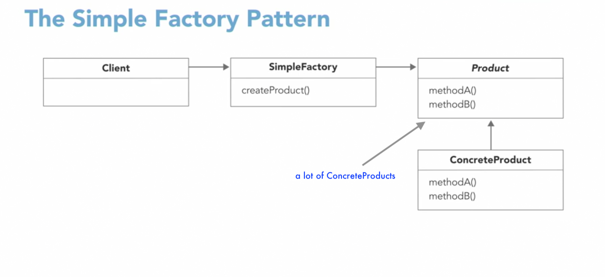
.Simple Factory Pattern Example
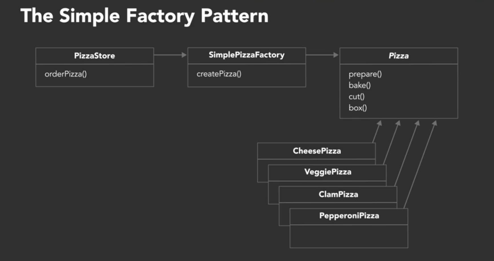
.Simple Factory Pattern Code Example
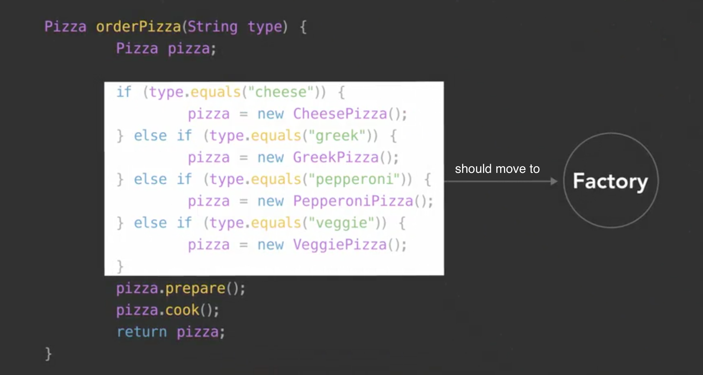
When we see code like the above, we know that if requirements change, and we want to add new duck types, we're going to have to open up this code and change it
and that violates the *open closed principle*.
We might also end up writing this same code in several places in this application, making the situation even worse.

Simple Factory pattern allows us to *decouple* the process of creating objects from the clients that use those objects.
Hence, we respect 'Encapsulate what varies principle.'

==== Factory Method
.Class Diagram
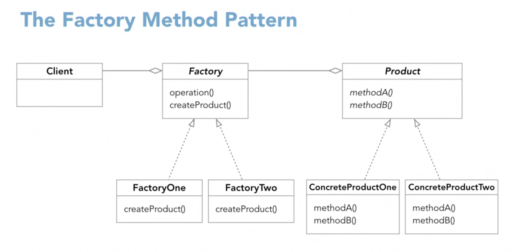
.Example
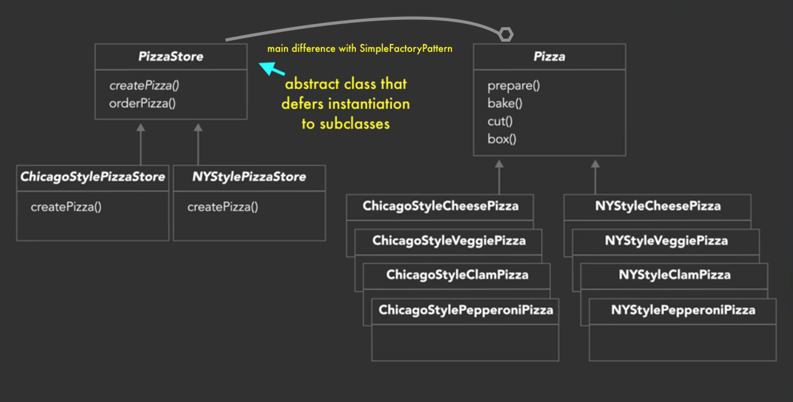
.Practical Example
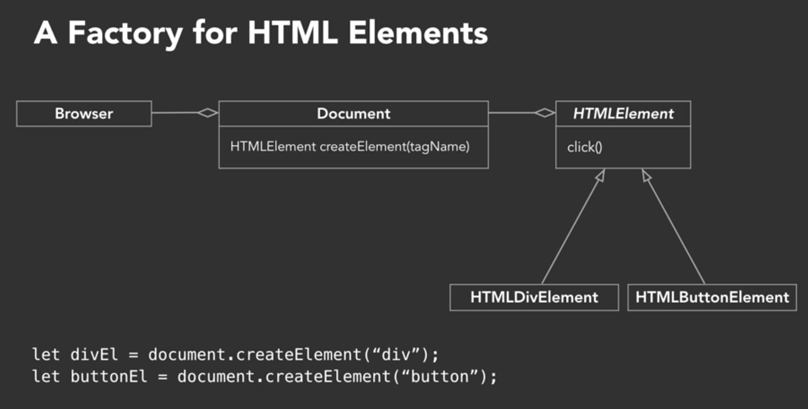

.When to use Factory Method?
When we know we need to create a new concrete object, but we can't predict which kind of concrete object to make.
Start by creating a Simple Factory then iterate.

.Design Principles and Factory Method
. Encapsulate what varies
. Program to an interface, not an implementation
. Open for extension, Closed for modification
. Depend on Abstractions

=== Abstract Factory Pattern
Type:: Creational
Definition:: Provide an interface *for creating families of related or dependent objects* without specifying their concrete classes.
.Class Diagram
image::images/abstract_factory_pattern_class_diagram.png[]
.Example
image::images/abstract_factory_pattern_example.png[]

.When to use Abstract Factory Method?
Imagine a scenario where you have a system that supports users with *different roles*.
We *use* the abstract factory pattern whenever we have a system that must be independent of how its products are created and represented, and the system is configured with one of multiple families of products.
If we decide the client should use a different family of products, all we have to do is *switch out which factory the client is using* to create the products and the new family of products is created for us.

.Design Principles and Abstract Factory Pattern
. Loosely coupled
. Similar principles like the Factory Method Pattern:
.. Encapsulate what varies
.. Program to an interface, not an implementation
.. Depend on Abstractions

=== Builder Pattern
Type:: Creational
Definition:: Separate the construction of a complex object from its representation so that the same construction process can create different representations.

.Example
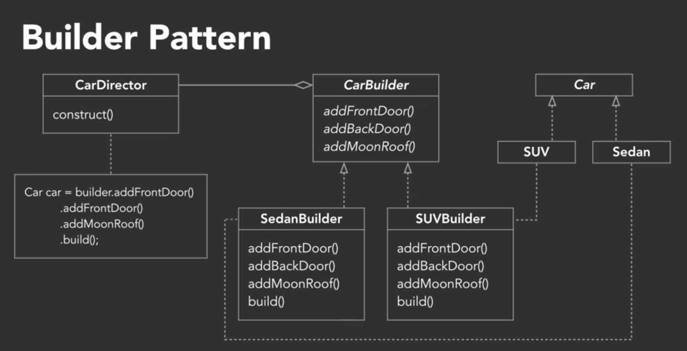

That means we want to allow the client the flexibility to create different representations of the same kind of object.

.Difference between Builder and Factory Pattern
Factory Pattern:: Concerned with encapsulating the *decision* about what *type* of products to create.
Builder Pattern:: Concerned with encapsulating the *complexities* of how we *build* an individual object.

.Flexibility in configuration
* The director uses a builder to build a product *step by step*. So, the builder interface must be flexible and general enough to support a variety of concrete
builders and the products they make.
By creating a general interface, we are building in flexibility to the builders we use.
* Using builder gives us fine control over the construction process by splitting the process into steps and giving control of that process to the director.

.Design Principles and Builder Pattern
The builder keeps our code open for extension by supporting a variety of concrete builders. And by using a common interface for the builders keeps the code in the client and the director closed for modification.

=== Prototype Pattern
Type:: Creational
Definition:: Specify the kinds of objects to create using a prototypical instance, and create new objects by copying the prototype.

A *Prototypical Instance* is an object we've created that will be used to make copies of itself to create new objects.

.Why Prototype?
* When we copy an existing object, we get the complex setup for free.
* We don't need to know the _concrete class_ of the object we're creating
* The client is independent of how an object is created because it's up to the object to make a copy of itself

.Design Principles and Prototype Pattern
Program to the interface, not the implementation principle
so the client can refer to the existing prototype using an interface, ask the prototype to create a copy of itself, and get a new object back.

.Use
This can be handy in situations where you are creating objects on the fly, or based on user input, for instance.

.Implementation
. Use a built in method
In Java, objects that implement the cloneable interface use a clone method to copy themselves.
. Create a new instance of the class and then copy the properties of the prototype object into that new object.
As long as what you return to the client is a new instance of that object type, the client doesn't need to know or care how that new instance is made.

.Comparing Factory Method and Prototype Patterns
In the Factory Method pattern, we have a parallel hierarchy of classes i.e. the Factory Hierarchy, and the Product Hierarchy. These two Hierarchy's mirror one another, because each Factory produces a different product.
With Prototype pattern, we have no need for a parallel hierarchy because the type of object instance we get, is determined by the type of object we clone. This can be decided at run time, based on state.

.Benefits of Prototype Pattern
. Prototype is particularity helpful when we're creating objects that are complex, or expensive to create new.
. Encapsulates object creation inside a prototypical instance object
. Client depends on the prototype abstraction, and not the concrete types of the objects created from the prototype, or the details of how new objects of
that type are created.
. `Java`'s `Cloneable` interface allows objects to clone themselves with the `clone()` method.
. JavaScript has direct support for object prototypes.
In `JavaScript`, we can create new objects directly from other objects using `Object.create()` and copy properties from object to another using `Object
.assign()`.
Unlike `Java`, `JavaScript` uses prototypal inheritance meaning that all objects inherit directly from other objects.

== Singleton Pattern
Type:: Creational
Definition:: Ensure a class only has one instance, and provide a global point of access to it.

.Class Diagram
image::images/singleton_pattern_class_diagram.png

NOTE:: One caveat with Singleton.
The implementation of this pattern is somewhat language-dependent. When you're implementing a Singleton, think about how to make your code thread safe so you
don't have to worry about multiple threads creating more than one instance of the Singleton.

.Design Principles and Singleton Pattern
. Encapsulate what varies
. Single Responsibility Principle
. NOT loosely coupled - common criticism of Singleton

=== Applying patterns
* Design patterns can be powerful.
* Don't think of patterns as a magic bullet. Patterns aren't the solution to every problem.
Once you've found a pattern that appears to be a good match, make sure it has a set of consequences you can live with and study its effects on the rest of your design.
Use patterns when you have a practical need to support change in a design today.
* *KISS*
** Remember, always solve things in the simplest way you can. Other developers will appreciate and admire the simplicity of your design.
* Design principles and patterns give us some useful tools that help us create software that is truly more flexible and resilient to change.
* Refactoring time is pattern time.
* If you don't need to use a pattern now, don't use it now. Otherwise, you end up with 'Design smell' in your project i.e. overly complicated design.

[quote, Leonardo Da vinchi]
Simplicity is the Ultimate Sophistication

[quote, Mosh]
Don't abuse the design patterns!

=== Memento pattern
Type:: Behavioural
Purpose:: Without violating encapsulation, capture and externalise an object's internal state so that it cn be restored to this state later.
.Pattern UML
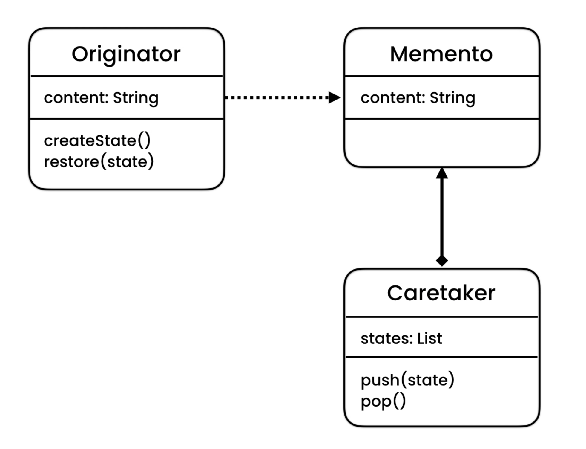
.Pattern Example
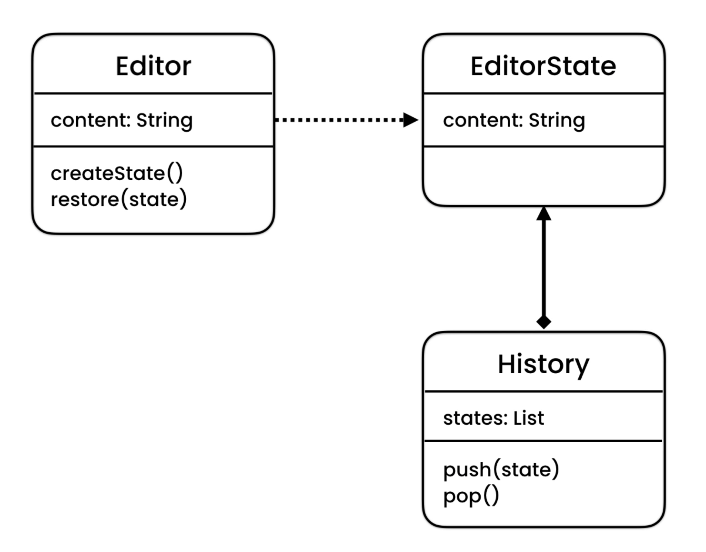

=== State Pattern
Type:: Behavioural
Definition:: Allow an object to alter its behavior when its internal state changes. The object will appear to change its class.

.Class Diagram
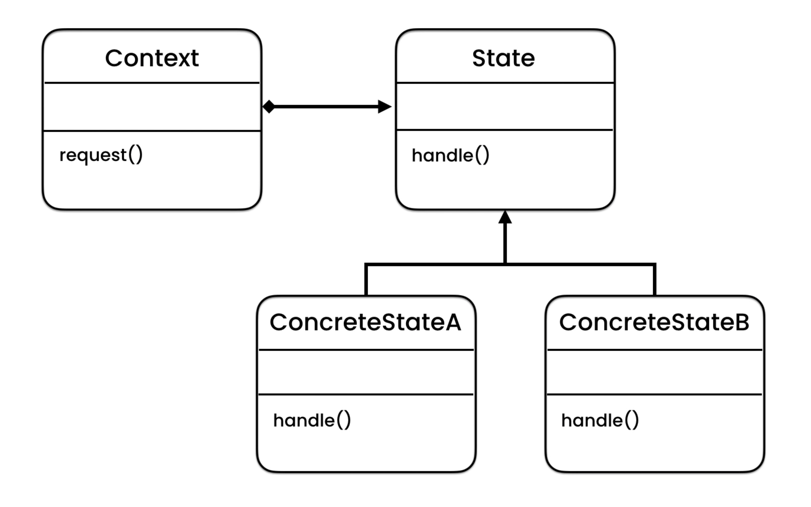
.Example
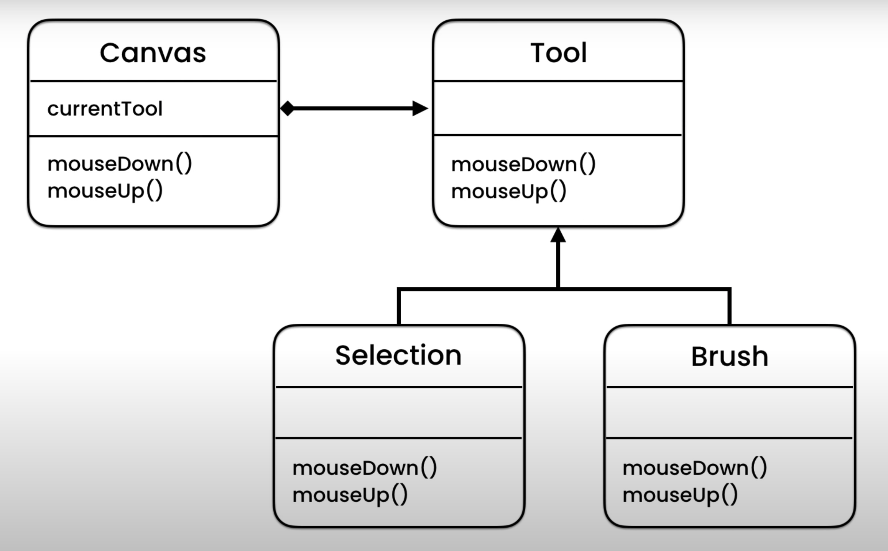