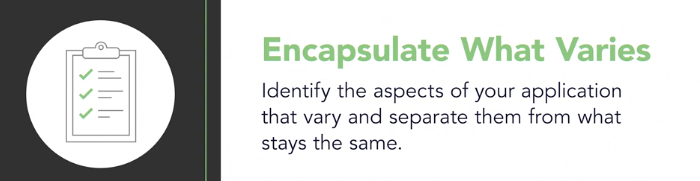

= Design Patterns
Biniam Asnake
1.0.0

== Object Oriented Programming Concepts
Interface:: a contract that specifies the functionalities/capabilities a class should provide
Encapsulation:: hiding the implementation detail
Abstraction:: reduce complexity by hiding unnecessary details (e.g. expose only one method and making others private). Promotes less coupling.
Inheritance:: a mechanism for reusing code by creating 'is-a' relationship between parent/super and child/sub classes. Promotes DRY
Polymorphism:: Poly means 'many', morph means 'form'. Hence, it is the ability of an object to take many forms

----
UML: Unified Modelling Language - official language to model our system to represent classes and their relationships.
----

.Types of Relationships
. Inheritance relationship (line with an unfilled rectangle)
`public class Rectangle extends Shape {}`
. Composition relationship (arrow with a diamond)
```
public class Shape {
    //  Shape class is composed of a Size class
    private Size size;
}
```
. Aggregation relationship (?)
. Dependency relationship (dashed arrow)
```
public class Shape {
    // Shape class depends on the Document class
    public void render(Document doc) {}
}
```


== Design Patterns
Design patterns are general solutions to OO problems.
It is an approach to thinking about software design that incorporate the experience of developers who have had similar problems.

.Benefits
. Not reinventing the wheel
. Building resilient code that can withstand change
. Prepare for future additions and change

=== Design Principles vs Design Patterns
Design Principles:: general guidelines on how to develop quality software.
E.g. 'Encapsulate what varies'
Design Patterns:: specific design solutions often named at solving common OO problems.
E.g. The Strategy pattern, the Iterator pattern, the Factory pattern

=== Problems with inheritance
image::images/problems_with_inheritance.png[]

. Because we are overriding a lot of methods, we are not getting the benefits of inheritance like code reuse
. We have code duplicated across classes like no flying and quacking overriding
. It is hard to get the whole knowledge about ducks by looking at the super class
. Changes can lead to unintended side effects
. All behaviour is assigned at compile time. Hence, runtime behaviour change is difficult

=== Interfaces for the rescue?
. An interface defines the methods an object must have inorder to be considered a particular type
. Interfaces allow different classes to share similarities. Not all classes need to have the same behavior, though.

image::images/ducks_with_interfaces.png[]

.Problems
. It destroys code reuse - every duck will implement its own fly() and quack() method
. Hence, maintenance becomes a nightmare
. It doesn't allow for runtime changes in behaviour

image::images/review_of_attempts.png[]


----
Design Principle - Encapsulate what Varies.

If some aspect of your code is changing, that's a strong indication that you need to pull out those parts that are changing and to
separate them from the rest of your code.

By separating out the parts of your code that change, you can extend or alter them without affecting the rest of your code.

This principle is fundamental to almost every design pattern.
----

image::images/program_to_interfaces.png[]

=== Strategy Pattern
Type:: Behavioural
Definition:: The Strategy Pattern defines a family of algorithms, encapsulates each one, and makes them interchangeable. This lets the algorithm vary
independently from clients that use it.

.Strategy pattern class diagram

.Pattern Example - Ducks

.Pattern Example - Phone Camera App
image::images/strategy_pattern_phone_camera_app.png[]


.favor_composition_over_inheritance
image::images/favor_composition_over_inheritance.png[]

----
Design Principle - Favor Composition over Inheritance
Instead of inheriting behavior, composition delegates the behavior to the composed object.
Leads to a more flexible and extensible design.
Allows for changing the behavior during runtime.
----


=== Memento pattern
Type:: Behavioural
Purpose:: Without violating encapsulation, capture and externalise an object's internal state so that it cn be restored to this state later.
.Pattern UML
image::images/memento_pattern.png[]
.Pattern Example


== S.O.L.I.D Principles
=== SRP - Single Responsibility Principle
Definition:: a class should only change for one reason only
Example:: Think of a restaurant. Every person has a specific role. The waiter is responsible for taking orders only. They don't cook for you.
Imagine a restaurant where the waiter takes your order, cooks for you, goes shopping and does the taxes. This is unmanageable.

